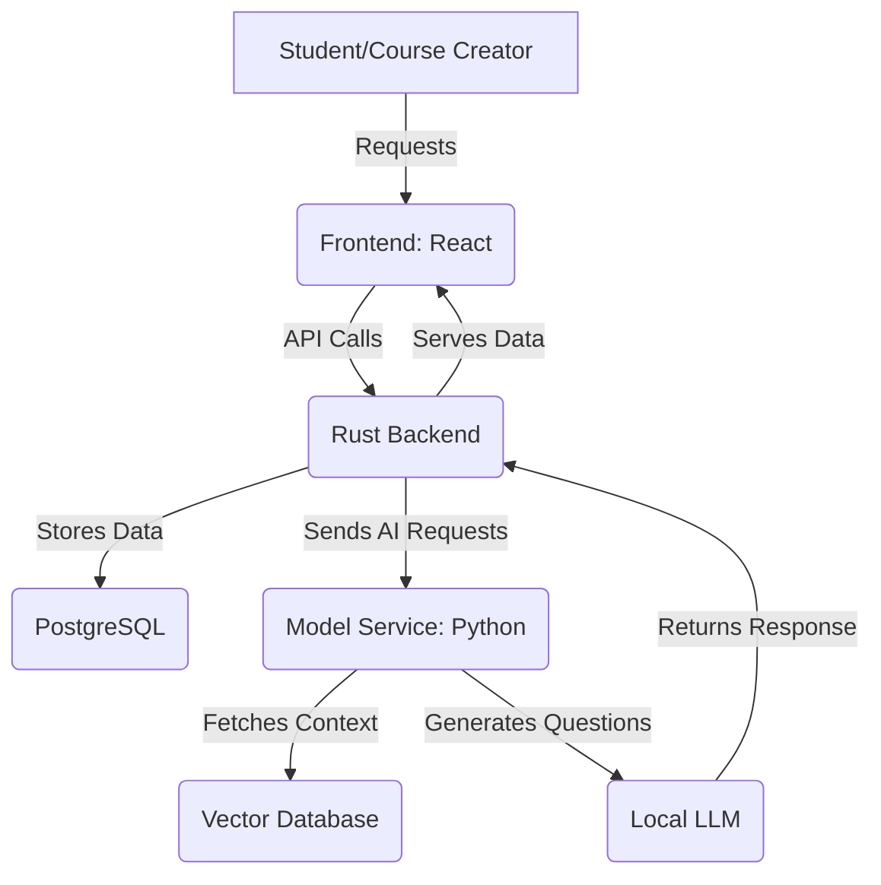

# **Exam Mentor**

**Exam Mentor** is an adaptive learning platform that dynamically generates questions tailored to a student's progress. It supports multiple domains, allowing course creators to define structured courses while leveraging AI-generated content.

## **Architecture Overview**

Exam Mentor consists of three main components:

1. **Frontend (Course Builder & Student Interface)**
   - **Built with:** React (TypeScript)
   - **Purpose:** 
     - **Course Builder:** Allows course creators to define courses, chapters, and questions.
     - **Student Interface:** Provides an adaptive learning experience with dynamically generated questions.

2. **Backend (Rust)**
   - **Built with:** Axum, SQLx, PostgreSQL
   - **Purpose:** 
     - Manages course definitions, tracks student progress, and fetches AI-generated questions.
     - Provides APIs for both students and course creators.

3. **Model Service (Python)**
   - **Built with:** FastAPI, LlamaIndex, LangChain
   - **Purpose:** 
     - Uses **Retrieval-Augmented Generation (RAG)** to fetch relevant context before generating questions.
     - Leverages a **local LLM** (e.g., Mistral, LLaMA) for fine-tuned question generation.

---

## **System Architecture Diagram**
### **High-Level System Flow**

---

## **Component Breakdown**
### **1️⃣ Frontend**
- **Course Builder**
  - Define courses, chapters, and seed questions.
  - Publish courses for students.

- **Student Interface**
  - Displays adaptive questions.
  - Tracks student progress.

---

### **2️⃣ Backend (Rust)**
- **Endpoints**
  - `/courses` → Manage courses.
  - `/chapters` → Organize chapters.
  - `/generate_question/{course_id}` → Fetch dynamically generated questions.

- **Database (PostgreSQL)**
  - Stores courses, chapters, and seed questions.
  - Tracks student progress.

---

### **3️⃣ Model Service (Python)**
- **RAG Workflow**
  1. **Retrieve relevant course content** from the vector database.
  2. **Generate new questions** based on user progress.
  3. **Return AI-generated multiple-choice questions.**

- **Vector Database**
  - Stores structured course content and knowledge.
  - Provides relevant data to enhance question generation.

---

## **Future Enhancements**
- ✅ **Fine-Tuning Option** → Allow clients to train their own models.
- ✅ **Adaptive Learning Model** → Dynamically adjust difficulty based on user performance.
- ✅ **Support for More Question Formats** → Add image-based, video-based, and open-ended questions.

---

This **README.md** provides an overview of the **Exam Mentor** system. Let me know if you want any refinements before we start coding! 🚀
