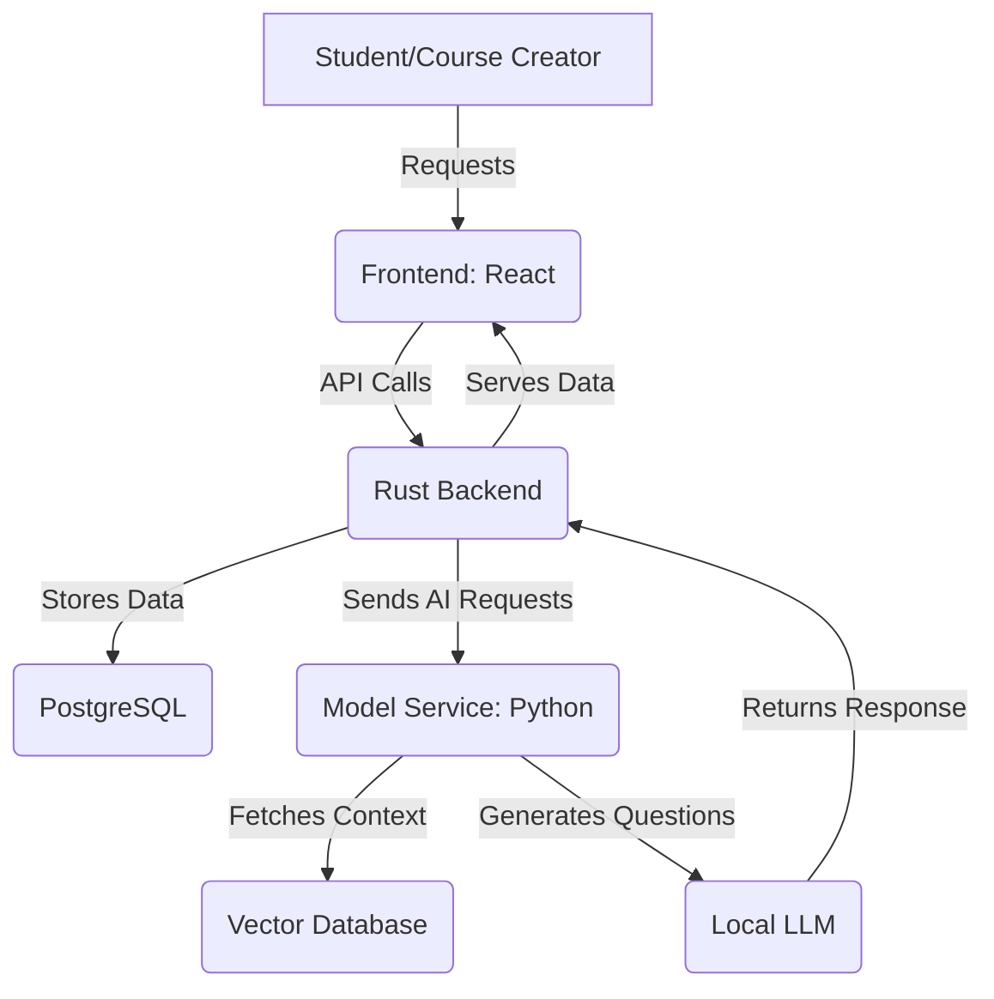

# **Exam Mentor**

**Exam Mentor** is an adaptive learning platform that dynamically generates questions tailored to a student's progress. It supports multiple domains, allowing course creators to define structured courses while leveraging AI-generated content.

---

## 📽️ Demo Video

🎥 **Watch the demo video**: [Exam Mentor Demo on Vimeo](https://vimeo.com/1058291487)

---

## **Architecture Overview**

Exam Mentor consists of three main components:

1. **Frontend (Course Builder & Student Interface)**
   - **Built with:** React (TypeScript)
   - **Purpose:** 
     - **Course Builder:** Allows course creators to define courses, chapters, and questions.
     - **Student Interface:** Provides an adaptive learning experience with dynamically generated questions.

2. **Backend (Rust)**
   - **Built with:** Axum, SQLx, PostgreSQL
   - **Purpose:** 
     - Manages course definitions, tracks student progress, and fetches AI-generated questions.
     - Provides APIs for both students and course creators.

3. **Model Service (Python)**
   - **Built with:** FastAPI, LlamaIndex, LangChain
   - **Purpose:** 
     - Uses **Retrieval-Augmented Generation (RAG)** to fetch relevant context before generating questions.
     - Leverages a **local LLM** (e.g., Mistral, LLaMA) for fine-tuned question generation.

---

## **System Architecture Diagram**
### **High-Level System Flow**


---

## **Component Breakdown**
### **1️⃣ Frontend**
- **Course Builder**
  - Define courses, chapters, and seed questions.
  - Publish courses for students.

- **Student Interface**
  - Displays adaptive questions.
  - Tracks student progress.

---

### **2️⃣ Backend (Rust)**
- **Endpoints**
  - `/courses` → Manage courses.
  - `/chapters` → Organize chapters.
  - `/generate_question/{course_id}` → Fetch dynamically generated questions.

- **Database (PostgreSQL)**
  - Stores courses, chapters, and seed questions.
  - Tracks student progress.

---

### **3️⃣ Model Service (Python)**
#### **Retrieval-Augmented Generation (RAG) Workflow**  
The **RAG** approach ensures that dynamically generated questions are accurate and contextually relevant by leveraging a **vector database** to retrieve domain-specific knowledge before generating a response.

1. **Retrieve relevant course content** → The system searches the vector database for the most relevant text passages based on the course topic and the student's progress.  
2. **Generate new questions** → The retrieved content is fed into the model, which formulates multiple-choice questions tailored to the learner's skill level.  
3. **Return AI-generated multiple-choice questions** → The backend delivers a structured question with plausible answer choices, ensuring an adaptive and engaging learning experience.  

#### **Vector Database**
- Stores structured course content, seed questions, and relevant knowledge snippets for different domains.  
- Ensures the LLM generates factually correct and context-aware questions by providing high-quality context before question generation.  
- Enhances adaptability by allowing fine-tuning based on course-specific data, making each course unique to its subject matter.  

## **🔧 Setup and Installation**

To run Exam Mentor, you need to set up the necessary dependencies for the frontend, backend, and model service. The project includes a **Makefile** to automate the installation and startup process.

### **Prerequisites**
Ensure you have the following installed on your system:
- **Rust** (for the backend) → Install via [rustup.rs](https://rustup.rs/)
- **Node.js & Yarn** (for the frontend) → Install via [nodejs.org](https://nodejs.org/)
- **Python 3** and **pip** (for the model service) → Install via [python.org](https://www.python.org/)
- **PostgreSQL** (for the database) → Install via [postgresql.org](https://www.postgresql.org/)

### **Installation Steps**
1. Clone the repository:
   ```sh
   git clone https://github.com/chiramlittleton/exam_mentor.git
   cd exam_mentor

2. Set up the environment variables:
   ```sh
   cp .env.example .env

3. Install dependencies and initialize the project:
   ```sh
   make install

## 🚀 Running the Application

You can start all services using the Makefile by running:

make run


This will start the Rust backend, the React frontend, the Python model service, and ensure PostgreSQL is running. If you prefer to run each service manually, navigate to each component’s directory and start it individually. To start the backend, run `cd backend && cargo run`. To start the frontend, run `cd frontend && yarn start`. To start the model service, activate the virtual environment and run `uvicorn app:app --host 127.0.0.1 --port 5000 --reload` from the `question_forge` directory.

⚠️ **Known Issues**: The Makefile is not fully functional yet. The installation process currently requires manual Python virtual environment setup and PostgreSQL configuration. Database migrations must also be run manually. If the database is not set up properly, run `make migrate`. Python dependencies must be installed in a virtual environment. If `make install` fails, manually create and activate a virtual environment using `python3 -m venv venv`, then activate it with `source venv/bin/activate` and install dependencies with `pip install -r requirements.txt`.

These issues will be addressed in future updates.

---
## **Future Enhancements**
- ✅ **Fine-Tuning Option** → Allow clients to train their own models.
- ✅ **Adaptive Learning Model** → Dynamically adjust difficulty based on user performance.
- ✅ **Support for More Question Formats** → Add image-based, video-based, and open-ended questions.
