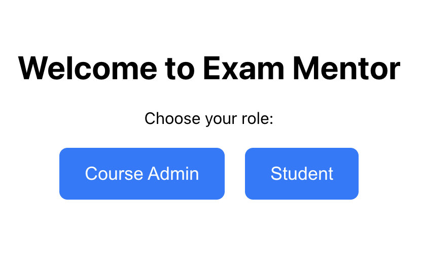
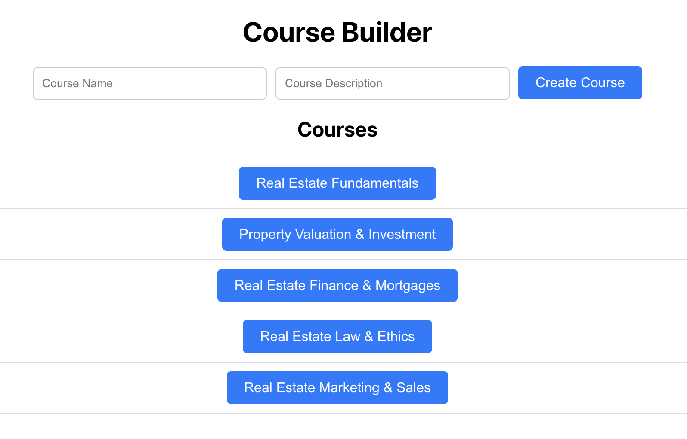
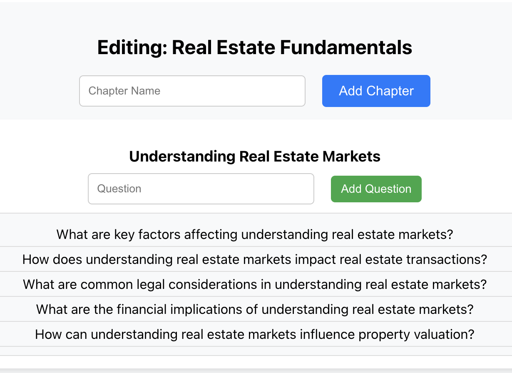
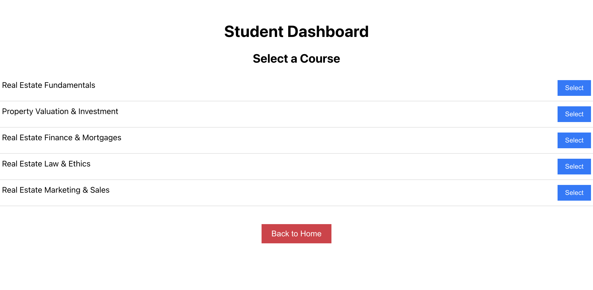
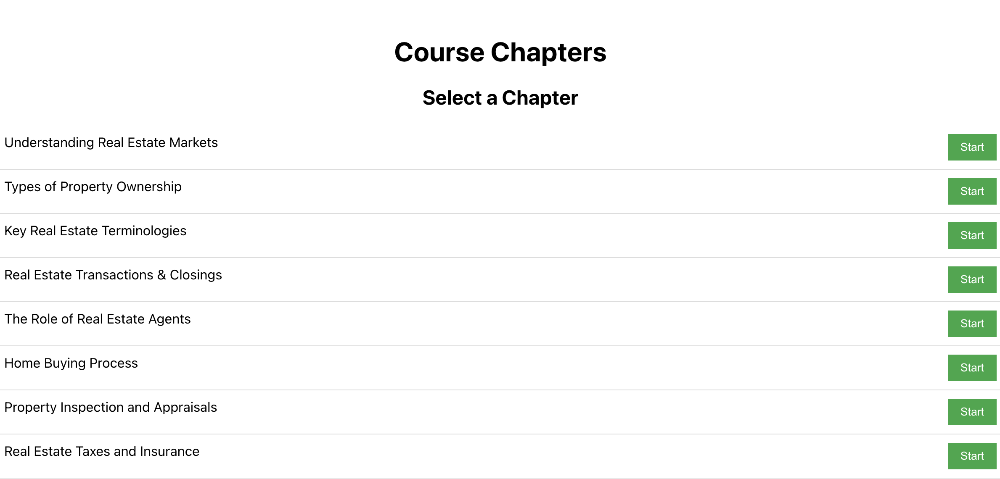
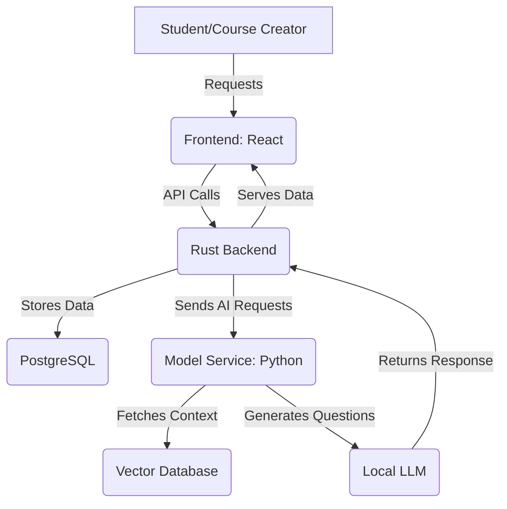

# **Exam Mentor**

**Exam Mentor** is an adaptive learning platform that allows **course administrators to create custom courses** using their own data. Students can then enroll in these courses, where they receive dynamically generated questions tailored to their progress. The platform leverages AI to generate content based on the course structure, ensuring an adaptive and personalized learning experience.

To enhance question generation, **Exam Mentor** utilizes **Retrieval-Augmented Generation (RAG)**, which retrieves relevant course materials from a **vector database** before generating questions. This ensures that AI-generated content is accurate, contextually relevant, and aligned with the specific course curriculum.


### **1️⃣ Welcome Screen**

- This is the **landing page** where users choose their role.
- Users can select between:
  - **Course Admin** → To create and manage courses.
  - **Student** → To enroll in courses and start learning.

---

### **2️⃣ Course Builder Dashboard (For Course Admins)**

- Displays a list of **existing courses**.
- Allows admins to **create new courses** by entering:
  - Course Name
  - Course Description
- Clicking on a course navigates to the **Course Editor**.

---

### **3️⃣ Course Editor (For Course Admins)**

- Displays the **selected course’s chapters**.
- Admins can:
  - **Add new chapters**.
  - **Add AI-generated questions** under each chapter.
- AI-generated questions are automatically retrieved from the **Model Service**.

---

### **4️⃣ Student Dashboard**

- Displays a list of **available courses**.
- Students can **select a course** to begin learning.
- Clicking on a course navigates to the **Course Chapters** view.

---

### **5️⃣ Course Chapters (For Students)**

- Displays a list of **chapters within a selected course**.
- Students can **select a chapter** to begin answering questions.
- Clicking "Start" navigates to the **Quiz Screen**.

---

### **6️⃣ Quiz Screen**

- Presents **AI-generated multiple-choice questions** for the selected chapter.
- Students can:
  - **Select an answer**.
  - **Move to the next question** or **finish the quiz**.
- Questions are dynamically generated based on **Retrieval-Augmented Generation (RAG)**.

---

## **Architecture Overview**

Exam Mentor consists of three main components:

1. **Frontend (Course Builder & Student Interface)**
   - **Built with:** React (TypeScript)
   - **Purpose:** 
     - **Course Builder:** Allows course creators to define courses, chapters, and questions.
     - **Student Interface:** Provides an adaptive learning experience with dynamically generated questions.

2. **Backend (Rust)**
   - **Built with:** Axum, SQLx, PostgreSQL
   - **Purpose:** 
     - Manages course definitions, tracks student progress, and fetches AI-generated questions.
     - Provides APIs for both students and course creators.

3. **Model Service (Python)**
   - **Built with:** FastAPI, LlamaIndex, LangChain
   - **Purpose:** 
     - Uses **Retrieval-Augmented Generation (RAG)** to fetch relevant context before generating questions.
     - Leverages a **local LLM** (e.g., Mistral, LLaMA) for fine-tuned question generation.

---

## **System Architecture Diagram**
### **High-Level System Flow**


---

## **Component Breakdown**
### **1️⃣ Frontend**
- **Course Builder**
  - Define courses, chapters, and seed questions.
  - Publish courses for students.

- **Student Interface**
  - Displays adaptive questions.
  - Tracks student progress.

---

### **2️⃣ Backend (Rust)**
- **Endpoints**
  - `/courses` → Manage courses.
  - `/chapters` → Organize chapters.
  - `/generate_question/{course_id}` → Fetch dynamically generated questions.

- **Database (PostgreSQL)**
  - Stores courses, chapters, and seed questions.
  - Tracks student progress.

---

### **3️⃣ Model Service (Python)**
#### **Retrieval-Augmented Generation (RAG) Workflow**  
The **RAG** approach ensures that dynamically generated questions are accurate and contextually relevant by leveraging a **vector database** to retrieve domain-specific knowledge before generating a response.

1. **Retrieve relevant course content** → The system searches the vector database for the most relevant text passages based on the course topic and the student's progress.  
2. **Generate new questions** → The retrieved content is fed into the model, which formulates multiple-choice questions tailored to the learner's skill level.  
3. **Return AI-generated multiple-choice questions** → The backend delivers a structured question with plausible answer choices, ensuring an adaptive and engaging learning experience.  

#### **Vector Database**
- Stores structured course content, seed questions, and relevant knowledge snippets for different domains.  
- Ensures the LLM generates factually correct and context-aware questions by providing high-quality context before question generation.  
- Enhances adaptability by allowing fine-tuning based on course-specific data, making each course unique to its subject matter.  

## **🔧 Setup and Installation**

### **Prerequisites**
Ensure you have the following installed on your system:
- **Docker & Docker Compose** → Install via [docker.com](https://www.docker.com/)
- **(Optional) Rust, Node.js, Python** → Only needed if running services manually

---
## **🔧 Setup and Installation**

### **Prerequisites**
Ensure you have the following installed on your system:
- **Docker & Docker Compose** → Install via [docker.com](https://www.docker.com/)
- **(Optional) Rust, Node.js, Python** → Only needed if running services manually

---

## **🚀 Quick Start (Mac/Linux) – Run Without Cloning**
Run the following command to **download and start Exam Mentor without cloning the repository**.

```sh
# 1️⃣ Create a new directory for the project
mkdir exam_mentor && cd exam_mentor

# 2️⃣ Download the latest docker-compose.yml and .env file
curl -O https://raw.githubusercontent.com/chiramlittleton/exam_mentor/main/docker-compose.yml
curl -O https://raw.githubusercontent.com/chiramlittleton/exam_mentor/main/.env

# 3️⃣ Prompt for OpenAI API key and add it to the .env file (Mac/Linux)
bash -c 'read -r -p "Enter your OpenAI API Key: " key; echo "OPENAI_API_KEY=$key" >> .env'

# 4️⃣ Start all services using Docker Compose
docker-compose up -d
```
## **Future Enhancements**
- ✅ **Fine-Tuning Option** → Allow clients to train their own models.
- ✅ **Adaptive Learning Model** → Dynamically adjust difficulty based on user performance.
- ✅ **Support for More Question Formats** → Add image-based, video-based, and open-ended questions.
